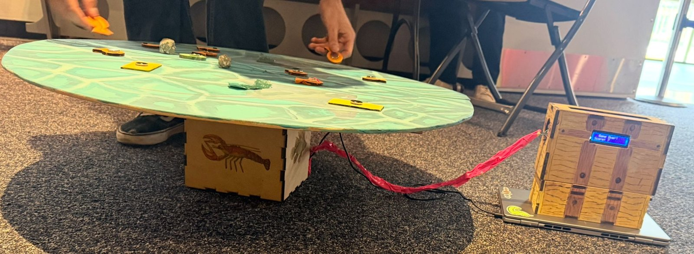
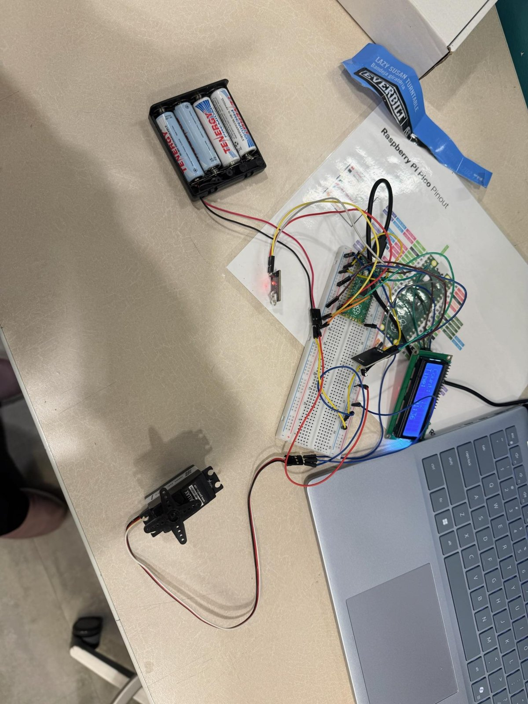
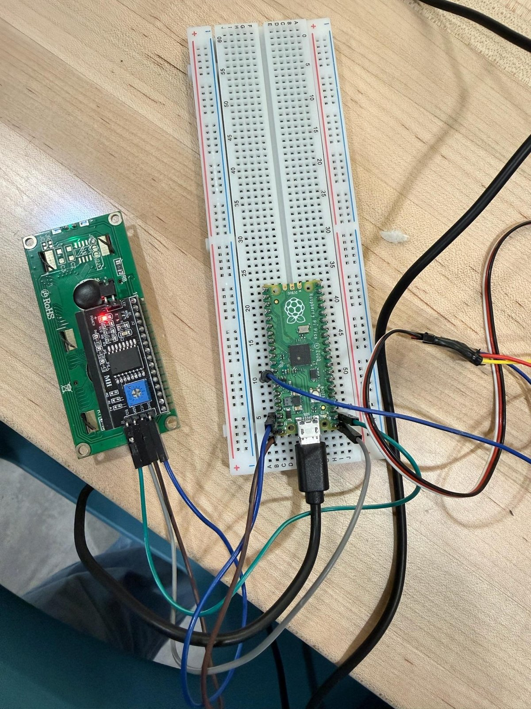
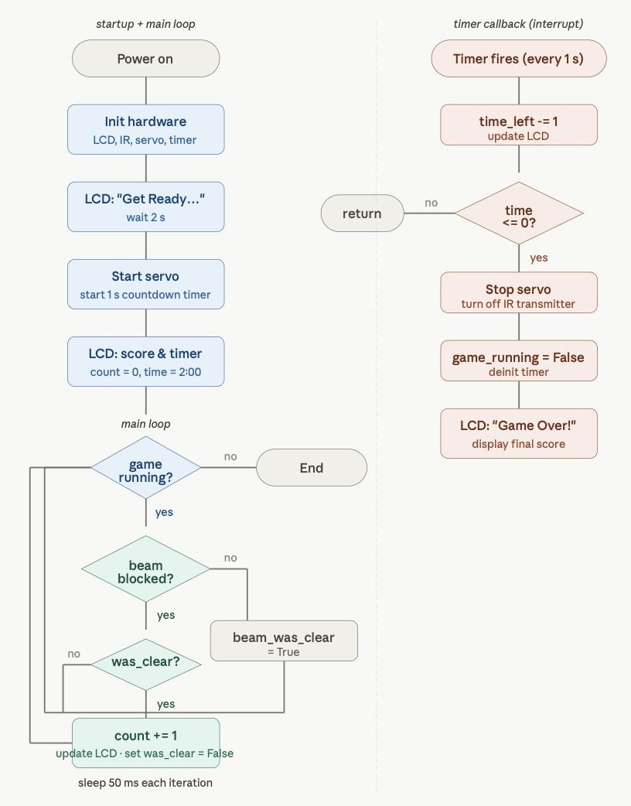
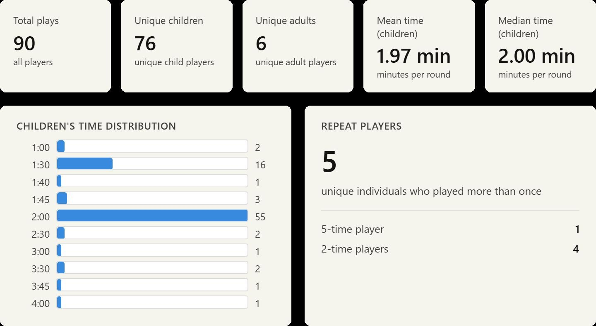
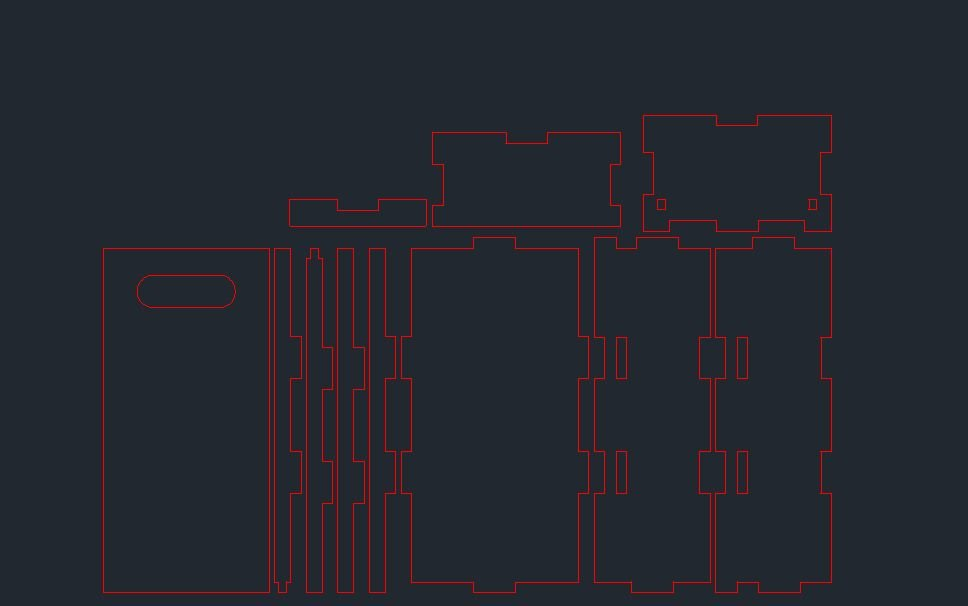

# Pirate Fishing Game

A spinning-disk fishing game built on a Raspberry Pi Pico for the Cornerstone of Engineering 2 final project at Northeastern University (May 2026). Players use magnetic fishing rods to catch fish and gold off a rotating disk and drop them into a collection box, where an IR beam counts each catch and an LCD shows the live score and a 2-minute countdown.

We built it with a 4-person team and ran it at an expo at the Boston Children's Museum, where 76 children played 90 rounds.

## Design goals

- Audience: museum visitors ages 4 to 8+
- Needs: safe, engaging, durable, and transportable
- Constraints: $120 budget, no choking hazards (every part over 35 mm), no sharp edges, latex, or slime
- Challenge: kids have different abilities, so the game has to be simple but still fun to replay

## Hardware

| Component | Pico pin | Voltage | Purpose |
|---|---|---|---|
| LCD SDA | GP0 | 3.3V | I2C data |
| LCD SCL | GP1 | 3.3V | I2C clock |
| LCD VCC | VBUS | 5V | Power |
| IR transmitter | GP14 | 5V | Always on, emits beam |
| IR receiver | GP15 | 3.3V | LOW = fish detected |
| Servo signal | GP16 | PWM 50 Hz | Spins the disk |
| Servo VCC | VBUS | 5V | Power |
| All GND | shared rail | 0V | Common ground |

- Raspberry Pi Pico running MicroPython
- 360° continuous-rotation servo (35 kg) to spin the disk
- IR breakbeam sensor in the collection box
- 16x2 I2C LCD for score and time
- Base, top, and collection box laser cut from MDF, designed in AutoCAD

## How the code works

`main.py` has two parts that run at the same time:

- **Main loop:** polls the IR receiver every 50 ms. A beam-state flag makes sure each fish only counts once, no matter how long it blocks the beam.
- **Hardware timer interrupt:** fires every second to update the countdown on the LCD. When time hits zero, it stops the servo, turns off the IR transmitter, and shows the final score.

## Challenges

- **Servo wouldn't spin:** the circuit was missing a shared ground rail.
- **IR sensor double-counted:** one fish could register several hits, so we added an edge-triggered beam-state flag.
- **Timer and beam detection conflicted:** moving the countdown to an interrupt-driven timer callback let both run without blocking each other.

## Results

| Test | Target | Measured | Result |
|---|---|---|---|
| Disk spins continuously | Full 2:00, no stalling | 10/10 trials | Pass |
| Live score on LCD | Updates within 50 ms | ~50 ms poll rate | Pass |
| 2:00 countdown | Within ±2 s | ±1 s across 10 trials | Pass |
| Auto-stop at zero | 100% of rounds | 10/10 rounds | Pass |
| Budget | Under $120 | $94 total | Pass |
| No choking hazards | All parts over 35 mm | Smallest piece 38 mm | Pass |

## Enclosure design

## Future improvements

- High score display
- Adjustable disk speed for different ages
- Sturdier top and tangle-free fishing lines

## Team

Andrew Bertrand, Presthika Vijaykumar, Tiffany Zhang, Jonas Van Kirk
